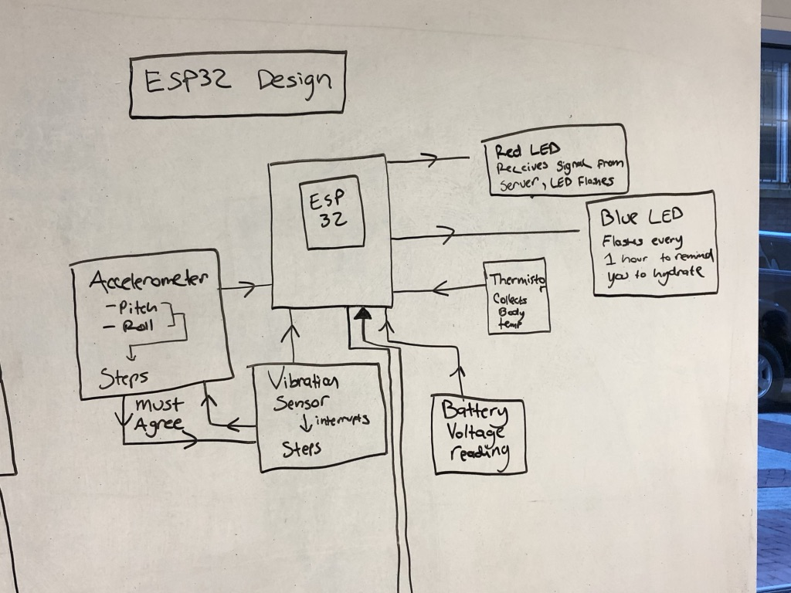
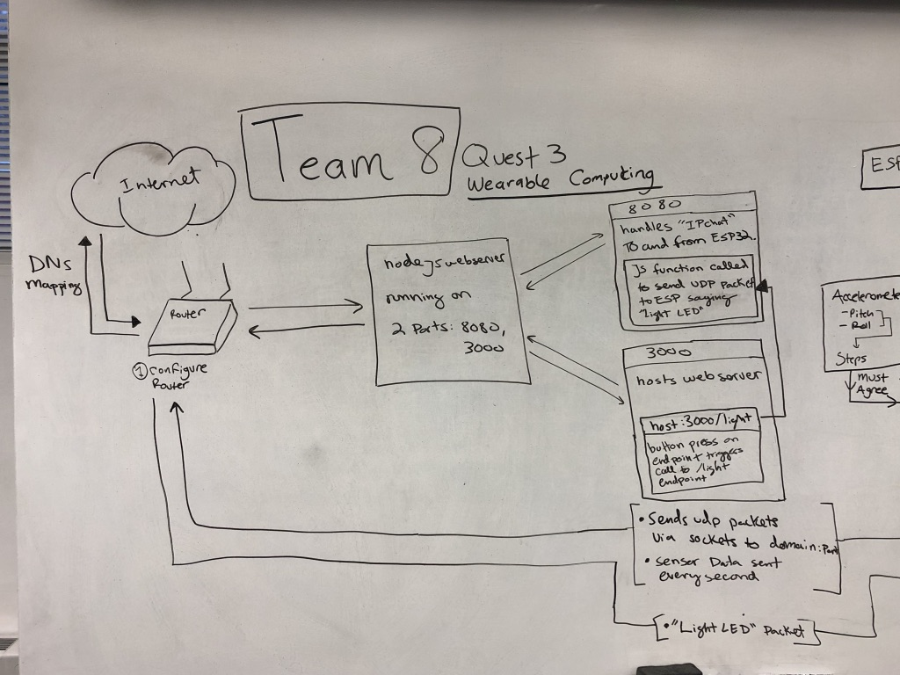
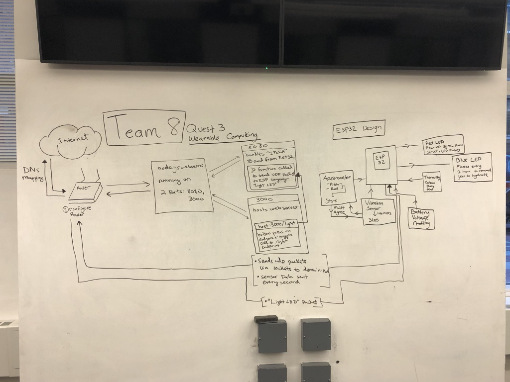

# Remote Access Wearable
Authors: Chase Clarke, Megan Heydari, Leila Lee

2019-10-24

## Summary
  Quest 3 involves building a wearable computing device that measures biometrics from the body and presents them on a webserver that multiple users can access. We used an accelerometer and vibration sensor to measure steps, a thermistor to measure body temperature, and a voltage divider to measure battery percentage. Additionally, we provided the user with some information in the form of LED signals so that he or she can locate the device from a button on the server and be reminded to drink water on a timer.

  This Quest involved the use of our microcontroller, the ESP32, a router that we configured, and online server communication.

## Evaluation Criteria
The solution requirements include:
- Must be able to control wearable from a remote interface
  - We accomplished this by setting up a local server on one of our local machines, connecting the ESP32 to the server via IP communication (via the router), and sending the data collected on the microcontroller to be recorded and plotted.

- Must be able to program 2 alerts (scheduled and instant) remotely
   - We met this requirement by having a button on our server that, when pressed, sends a signal to the ESP32 lighting up the red LED, so that the user can find the device if lost. Additionally, we had a blue LED that uses an internal clock to blink and remind the user to hydrate every hour. 

- Must show accurate status report of wearable metrics (step, temperature, and battery level) in real-time at remote client
  - This can be seen in our video demonstration. The plots, created using canvas.js, on our client server update every second with data sent from the ESP32.

## Investigative question:
What are steps you can take to make your device and system low power? Please cite sources for you answer.
Answer:
### Hardware:
- Reduce Vcc and Current
- The choice of microcontroller actually makes a difference so it might be best to use a lower power controller

### Software:
- Reduce clock frequency
- Use an “instant-on” clock so that current is not wasted while the clock stabilizes
- Use interrupts so that the CPU can sleep until a button is pushed
- One should use low power peripherals
- “A true low-power peripheral is one that consumes no current when not in use “
- Extremely low currents are achieved by shutting down the entire device with the exception of a small amount of memory, a real-time clock and perhaps a watch dog timer

Sources:

https://www.egr.msu.edu/classes/ece480/capstone/fall11/group07/file/Document_files/Technical_Lecture.pdf

https://www.embedded.com/taking-advantage-of-new-low-power-modes-on-advanced-microcontrollers/

## Solution Design

### ESP32 data collection

  

  We first tasked ourselves to figure out how to obtain required biometrics with the ESP32. In order to create an accurate pedometer, we used both the accelerometer and the vibration sensor. The accelerometer was set up using I2C protocol and reading in the different x, y, z orientations of the device, relative to gravity. These coordinates were converted to the more understandable measures of pitch and roll. From here, we developed a simple algorithm to convert this to step count. After collecting some empirical data, we found that, no matter the orientation, if either the pitch or roll changed by more than 20 units, a step had been taken. The vibration sensor uses hardware interrupts to count steps. When an interrupt is detected, a step is counted.

 Collecting the thermistor data to calculate temperature was simple, as we were able to repurpose code from a previous skill. The ESP32 reads a voltage from the thermistor, which corresponds to temperature via its internal resistance. We found that the temperature probe was much more accurate than the previous probes we had used for the skill.

  We were also able to repurpose our code for measuring battery power. We built a voltage divider and fed it into an ADC pin where we could calculate percentage of battery based on the reading relative to what the full power reading would be.

  Once a second the ESP sends its sensor data to the listening webserver. Concurrently, it listens for commands from the webserver. if it ever recieves "Light" it executes the LED lighting task.

#### A brief description of the technical setup for our hardware is found below:
- Measurements for step, body temperature, and battery level
  - Battery Voltage:
    - Pin Assignment: adc1 channel 0 (A4)
  - Thermistor:
    - Pin Assignment: adc1 channel 3 (A3)
  - Vibration Sensor:
    - Pin Assignment: GPIO 4 (A5)
  - Accelerometer
    - i2c

- Regularly scheduled alerts [to drink water] (blinks blue LED)
  - Alarm LED:
    - Pin Assignment: GPIO 21

- Ability to find your device from web portal (blinks red LED)
  - Finder LED:
    - Pin Assignment: GPIO 25 (A1)

### Node Js Networking

  

The networking aspect of the quest is composed of a NodeJS file hosting a webserver on port 3000 and a socket listener on port 8080.

#### port 3000:

   A simple NodeJS webserver that directs the client to index.html where all the data is displayed. Special functionality includes a /light endpoint (hit when user presses button) that triggers the light command on the esp.

#### port 8080:

   A UDP complient webserver hosted to interact with the ESP32. It listens for the once a second data transfer from the esp and when prompted, sends "Light" to the listening ESP who will then light its LED.

## Sketches and Photos

  

 

  

 

  

 

## Supporting Artifacts
- [Link to repo]()
- 

## References

[Accelerometer Pedometer](https://www.aosabook.org/en/500L/a-pedometer-in-the-real-world.html)

[Low Power Reading #1](https://www.egr.msu.edu/classes/ece480/capstone/fall11/group07/file/Document_files/Technical_Lecture.pdf)

[Low Power Reading #2](https://www.embedded.com/taking-advantage-of-new-low-power-modes-on-advanced-microcontrollers/)

[no-ip](https://www.noip.com/login?ref_url=console#!/account)

-----

